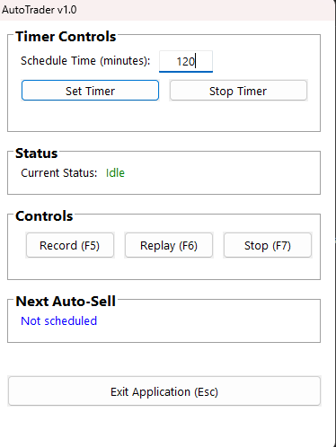

# Industry Idle AutoTrader

An automation tool designed for Industry Idle game, featuring mouse action recording and scheduled replay functionality.

## Features

### Recording System
- Record mouse movements, clicks, and scroll actions (F5)
- Captures precise mouse positions and drag operations
- Records all interactions within the game window

### Replay System
- Replay recorded actions (F6)
- Stop ongoing replay (F7)
- Maintains exact timing and positioning
- Supports click-and-drag operations

### Auto-Sell Timer
- Schedule automated selling at custom intervals
- Set timer duration in minutes
- Start/Stop timer functionality
- Real-time countdown display
- Auto-replays recorded sequence when timer triggers

### User Interface
- Clean, organized layout with grouped controls
- Easy-to-use buttons with hotkey indicators
- Visual feedback for active operations
- Always-on-top window for easy access

## Installation

1. Download the latest release from the [Releases](https://github.com/yourusername/II-AutoTrader/releases) page
2. Extract the files to your preferred location
3. Run `II-AutoTrader.exe`

## How to Use

1. **Recording a Sequence:**
   - Click 'Record (F5)' or press F5
   - Perform your desired actions in the game
   - Click 'Record (F5)' again to stop recording

2. **Playing Back:**
   - Click 'Replay (F6)' or press F6 to replay recorded actions
   - Use 'Stop (F7)' or press F7 to stop replay

3. **Setting Up Auto-Sell:**
   - Enter desired interval in minutes
   - Click 'Set Timer' to start automated replay
   - Use 'Stop Timer' to cancel automation

## Requirements
- Windows Operating System
- Industry Idle game window must be active when recording

## Contributing
Feel free to submit issues and enhancement requests!

## License

This project is licensed under the MIT License - see the [LICENSE](LICENSE) file for details.

## Author

- Zicarius
- Created: February 07, 2025